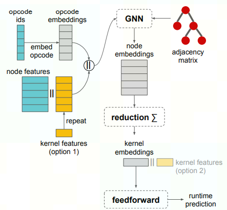
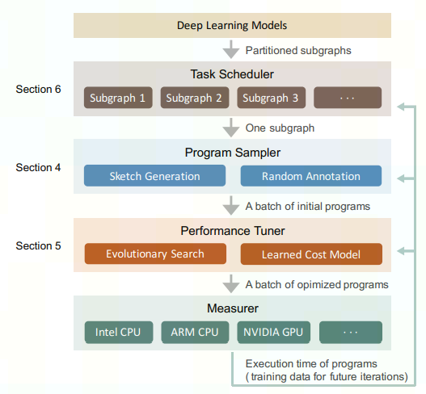

## 文献调研结果

**基于图卷积网络的卷积神经网络耗时预测算法**

cc

**A Learned Performance Model for Tensor Processing Units**

GNN Cost Model 预测执行时间

- [ ] **Learning to Optimize Tensor Programs**

Statistical Cost Model + simulated annealing

    AutoTVM requires hand-crafted manual templates for each tensor operator, then uses simulated annealing (SA) and a cost model to search for fast schedules

- [x] **FlexTensor: An Automatic Schedule Exploration and Optimization Framework for Tensor Computation on Heterogeneous System**

Background:  

    high demand for flexible, portable, and high-performance *library implementation* on heterogeneous hardware accelerators.

Method: *Template-guided search*

Front-End:

    static analysis to analyze the computation pattern and generates a *hardware-specific* schedule space. *Predefined manually-written templates*

Back-End: to generate an optimized *schedule*

     combine heuristics methods with machine learning methods

    heuristic method to get a step-length,  machine learning method(Q-Learning) to get best direction.

    cpu/gpu measurement aproch; fpga performance models

- [x] **Ansor: Generating High-Performance Tensor Programs for Deep Learning**

AI 编译框架 TVM 的一个子模块 —— ANSOR： *upgraded version of AutoTVM*

recent method: 

1. Template-guided search:  
   
   1. developing templates requires substantial effort

2. Sequential construction based search: 
   
   1. developing templates requires substantial effort

Ansor’s hierarchical approach：a hierarchical search space

三种方式对比：

Design Overview

1. uses the operator fusion algorithm from Relay [42] to convert DNNs from popular model formats to partitioned small subgraphs

2. Program Sampler: defines the high-level structures of programs as sketches and leaves billions of lowlevel choices as annotations

3. Performance tuner: evolutionary search and a learned cost model to perform fine-tuning iteratively

4. Task scheduler: allocate resources to the subgraphs that are more likely to improve the end-to-end DNN performance.

Sketch Generation： a derivation-based enumeration approach to generate all possible sketches by recursively applying several basic rules.

Random Annotation:  randomly fill out tile sizes, parallelize some outer loops, vectorize some inner loops, and unroll a few inner loops etc.

Performance Fine-tuning:

   1. find a small batch of promising programs according to a learned cost model

2. measure these programs on hardware to get the actual execution  
   time cost

3. profiling data got from measurement is used to re-train the cost model to make it more accurate
- [x] **Bansor: Improving Tensor Program Auto-Scheduling with Bandit Based Reinforcement Learning**

两个子问题的优化：

1. Sketch Selection using UCB to select better sketch

2. Task Selection: use UCB instead of  $\epsilon$-greedy to balance exploration and exploitation

**TLP: A Deep Learning-based Cost Model for Tensor Program Tuning**

extracts features from the schedule primitives

- [ ] **Tensor Program Optimization with Probabilistic Programs**

This paper introduces MetaSchedule, a domain-specific probabilistic programming language abstraction to construct a rich search space of tensor programs

Moses: Efficient Exploitation of Cross-device Transferable Features for Tensor Program Optimization

- [ ] AI Powered Compiler Techniques for DL Code Optimization

high level -> cache memory: polyhedral compilation techniques

low level -> SIMD units: vector intrinsics and Reinforcement Learning (RL) techniques
